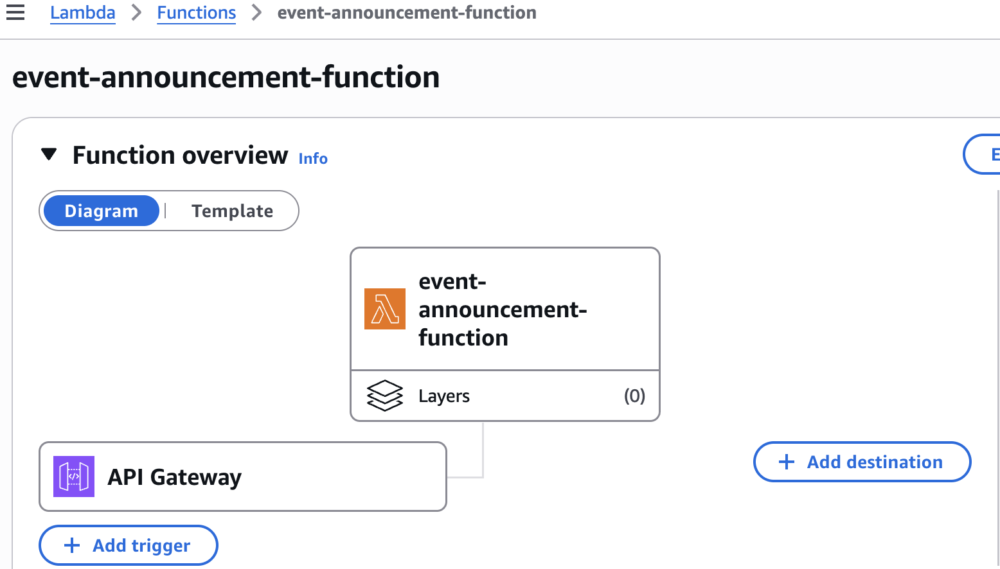
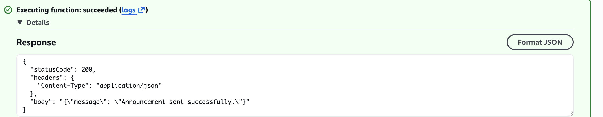
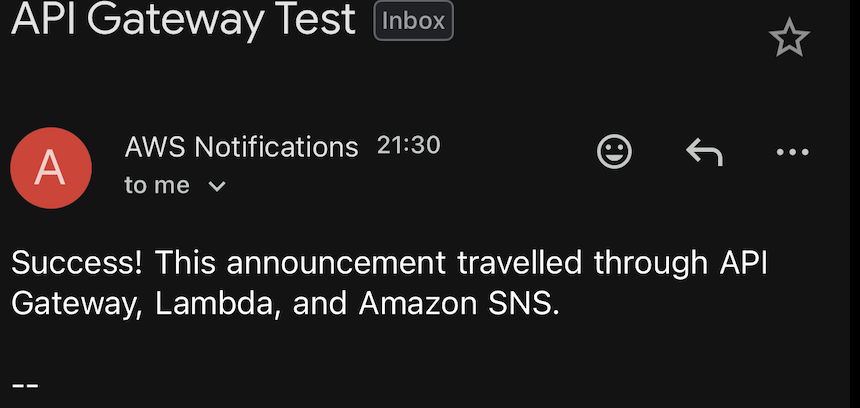

# AWS Serverless Event Announcement System

A serverless event announcement system that accepts HTTP requests through Amazon API Gateway, processes them with AWS Lambda, and sends email notifications through Amazon SNS.

## Architecture

```text
User/Client → API Gateway → AWS Lambda → Amazon SNS → Email Subscriber
```

## AWS Services Used

- Amazon API Gateway
- AWS Lambda
- Amazon Simple Notification Service (SNS)
- AWS Identity and Access Management (IAM)
- Amazon CloudWatch Logs

## How It Works

1. A client sends an announcement to the API Gateway endpoint.
2. API Gateway invokes the Lambda function.
3. Lambda validates the JSON request.
4. Lambda publishes the announcement to the SNS topic.
5. SNS delivers the message to confirmed email subscribers.
6. Lambda activity is recorded in CloudWatch Logs.

## Example Request

```bash
curl -X POST "YOUR_API_ENDPOINT" \
  -H "Content-Type: application/json" \
  -d '{
    "subject": "Upcoming Cloud Workshop",
    "message": "You are invited to our AWS Cloud Workshop."
  }'
```

## Example Response

```json
{
  "message": "Announcement sent successfully."
}
```

## Security

- The Lambda function uses an environment variable named `TOPIC_ARN`.
- The SNS topic ARN is not hard-coded in the Python source code.
- The Lambda execution role follows least privilege and allows `sns:Publish` only to the required SNS topic.
- Sensitive account identifiers and active endpoints are excluded from this repository.

## Project Files

```text
.
├── README.md
├── iam-policy.json
├── lambda_function.py
└── screenshots/
    ├── architecture.png
    ├── email-notification.png
    └── lambda-test-success.png
```

## Screenshots

### API Gateway and Lambda Architecture



### Successful Lambda Test



### Email Notification



## Skills Demonstrated

- Building serverless applications on AWS
- Creating HTTP APIs with API Gateway
- Developing Lambda functions with Python and Boto3
- Publishing notifications with Amazon SNS
- Configuring IAM permissions using least privilege
- Managing configuration with environment variables
- Testing and troubleshooting AWS integrations
